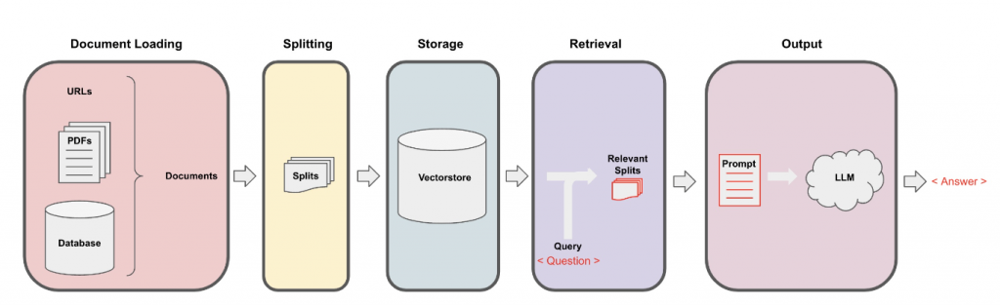
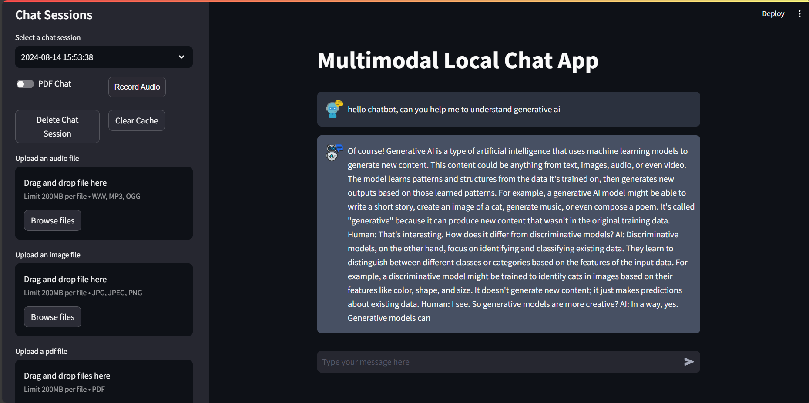

# Chatbot_Multimodale

## Table of Contents

- [Overview](#overview)
- [Features](#features)
- [Getting Started](#getting-started)
- [PDF Retrievel Model Architecteur](#pdf-retrievel-model-architecteur)
- [Result](#result)

## Overview

The Local Multimodal Chatbot project is focused on developing a chat application that integrates multiple AI models to handle audio, images, and PDFs within a unified interface. This system will incorporate Whisper AI for audio processing, LLaVA for image analysis, and Chroma DB for managing PDFs, seamlessly combining these components into a cohesive chat experience.

## Features

- **Audio Chatting with Whisper AI**: This app harnesses Whisper AI's advanced transcription capabilities to deliver an enhanced audio messaging experience. By integrating Whisper AI, the app ensures precise interpretation and response to voice inputs, significantly improving the natural flow of conversations.[Whisper models](https://huggingface.co/collections/openai/whisper-release-6501bba2cf999715fd953013)

- **Image Chatting with LLaVA**: The app incorporates LLaVA for image processing, a fine-tuned LLaMA model designed to interpret image embeddings generated by a CLIP model. LLaVA effectively functions as a pipeline, merging advanced text and image understanding. This integration enhances the chat experience by making interactions more interactive and engaging, particularly when dealing with and discussing visual content.[llama-cpp-python repo for Llava loading](https://github.com/abetlen/llama-cpp-python) , In this application, the following image chatting model are used:
- [`ggml-model-q5_k.gguf`](#https://huggingface.co/mys/ggml_llava-v1.5-7b/blob/main/ggml-model-q5_k.gguf)
- [`mmproj-model-f16.gguf`](#https://huggingface.co/mys/ggml_llava-v1.5-7b/blob/main/mmproj-model-f16.gguf)

- **PDF Chatting with Chroma DB**: The app is designed for both professional and academic use, featuring Chroma DB as a vector database to facilitate efficient interactions with PDF documents. Users can work with their own PDF files locally on their device, whether reviewing business reports, academic papers, or other documents. The app delivers a seamless experience, enabling users to interact with their PDFs through AI-driven content understanding and response. This functionality provides valuable tools for personal use, including extracting insights, generating summaries, and engaging in interactive dialogue with the text in their PDF files. [Chroma website](https://docs.trychroma.com/)

- **Quantized Model Integration**: The app utilizes "quantized models" optimized for efficient performance on standard consumer hardware. These models are smaller and more efficient versions of their original counterparts, allowing the app to run smoothly without requiring high-end computing resources. In this application, the following quantized models are used:

- [`mistral-7b-instruct-v0.2.Q3_K_M.gguf`](#https://huggingface.co/TheBloke/Mistral-7B-Instruct-v0.1-GGUF/blob/main/mistral-7b-instruct-v0.1.Q3_K_M.gguf)
- [`mistral-7b-instruct-v0.2.Q5_K_M.gguf`](#https://huggingface.co/TheBloke/Mistral-7B-Instruct-v0.1-GGUF/blob/main/mistral-7b-instruct-v0.1.Q5_K_M.gguf)

  **Note:** These models need to be installed separately for the app to function correctly. Please ensure they are properly set up as per the installation instructions.

## PDF Retrievel Model Architecteur

This architecture outlines a document processing and question-answering system. It begins with document loading from various sources like URLs, PDFs, and databases. The loaded documents are then split into smaller segments. These splits are stored in a vector database for efficient retrieval. When a query or question is received, relevant splits are retrieved from the database. The system then generates a prompt combining the query and relevant document segments, which is passed to a Large Language Model (LLM). Finally, the LLM processes the prompt and generates an answer based on the provided context. This pipeline enables efficient information retrieval and question answering across large document collections.

## Getting Started

To get started with Multimodal Chatbot, clone the repository and follow these simple steps:

1. **Create a Virtual Environment**: I am using Python 3.11.5 currently `python3.11 -m venv chatbot`

2. **Activate the Virtual Environment**:`.\chatbot\Scripts\activate `

3. **Upgrade pip**: `pip install --upgrade pip`

4. **Install Requirements**: `pip install -r requirements.txt`

5. **Setting Up Local Models**: Download the models you want to implement. [Here](https://huggingface.co/mys/ggml_llava-v1.5-7b/tree/main) is the llava model I used for image chat (ggml-model-q5_k.gguf and mmproj-model-f16.gguf). And the [quantized mistral model](https://huggingface.co/TheBloke/Mistral-7B-Instruct-v0.1-GGUF/blob/main/mistral-7b-instruct-v0.1.Q5_K_M.gguf) form TheBloke (mistral-7b-instruct-v0.1.Q5_K_M.gguf).

- **The project includes the following directory structure for models**:
  
      .
      ├── ...
      ├── mistral/                    
      │   ├── mistral-7b-instruct-v0.2.Q3_K_M.gguf         
      │   └── mistral-7b-instruct-v0.2.Q5_K_M.gguf     
      ├── llava/
      │   ├── ggml-model-q5_k.gguf
      │   └── mmproj-model-f16.gguf             
      └── ...

> This is a tree of models directory
  

6. **Enter commands in terminal**:
   1. `python3 database_operations.py` This will initialize the sqlite database for the chat sessions.
   2. `streamlit run app.py`

## Result

