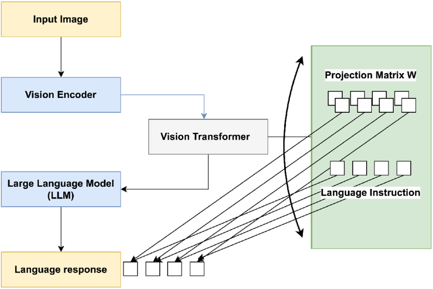

# Chatbot_Multimodal

## Table of Contents

- [Overview](#overview)
- [Features](#features)
- [Getting Started](#getting-started)
- [Configuration](#configuration)
- [Result](#result)
<!-- - [PDF Retrievel Model Architecteur](#pdf-retrievel-model-architecteur) -->

## Overview

The Local Multimodal Chatbot project is focused on developing a chat application that integrates multiple AI models to handle audio, images, and PDFs within a unified interface. This system will incorporate Whisper AI for audio processing, LLaVA for image analysis, and Chroma DB for managing PDFs, seamlessly combining these components into a cohesive chat experience.

## Features

### **1. Audio Chatting with Whisper AI**

This app utilizes Whisper AI's advanced transcription capabilities to deliver an enhanced audio messaging experience. Whisper AI ensures precise interpretation and response to voice inputs, significantly improving the natural flow of conversations.

- **Why Choose Whisper?**

  Whisper is a versatile and accurate solution for an audio speech chatbot. It handles multiple tasks such as speech recognition, translation, and language identification within a single model. Unlike traditional systems that require different stages for each task, Whisper simplifies the process, making it more efficient and streamlined. This versatility is particularly useful in multilingual environments, where Whisper can seamlessly switch between languages and tasks, ensuring a smooth user experience.

  

- **How Whisper Works**

  Whisper operates using a Transformer sequence-to-sequence model. Trained on a vast and diverse dataset, it understands and processes speech in different languages and contexts. The model converts audio input into a sequence of tokens that represent the speech content, using a decoder to predict the desired output—whether it’s text, translated text, or a language label.

  The multitasking ability of Whisper is achieved through special tokens that instruct the model on which task to perform, making it a powerful all-in-one solution for speech processing.

  - [Whisper Models](https://huggingface.co/collections/openai/whisper-release-6501bba2cf999715fd953013)

### **2. Image Chatting with LLaVA**

The app incorporates LLaVA for image processing, a fine-tuned LLaMA model designed to interpret image embeddings generated by a CLIP model. LLaVA effectively functions as a pipeline, merging advanced text and image understanding. This integration enhances the chat experience by making interactions more interactive and engaging, particularly when dealing with and discussing visual content.

- **Why Choose LLaVA?**

  LLaVA is specifically chosen for image processing due to its ability to generate coherent and contextual text based on image embeddings. The ggml_llava-v1.5-13b model is particularly effective for tasks that require understanding and generating detailed descriptions, answering questions about images, and summarizing visual content. This makes it ideal for use cases like content creation, chatbots, and interactive language learning.

  LLaVA is not only versatile in generating text but also provides rich and contextual understanding of images, making it a powerful tool for applications that need seamless integration of visual and textual information.

  

- **How LLaVA Works**

  The LLaVA (Large Language and Vision Assistant) model integrates vision and language processing capabilities. It processes input images through a Vision Encoder and Transformer, projecting the resulting features into a language-compatible space using a Projection Matrix. This visual information is then combined with textual input in a Large Language Model (LLM). The LLM processes both visual and textual data to generate appropriate language responses. This architecture enables LLaVA to perform complex tasks requiring both visual comprehension and language generation, such as image captioning and visual question answering. By bridging the gap between visual and textual information, LLaVA represents a significant advancement in multimodal AI systems.

- [llama-cpp-python repo for Llava loading](https://github.com/abetlen/llama-cpp-python)

- **Image Chatting Models Used:**

  - [ggml-model-q5_k.gguf](#https://huggingface.co/mys/ggml_llava-v1.5-7b/blob/main/ggml-model-q5_k.gguf)
  - [mmproj-model-f16.gguf](#https://huggingface.co/mys/ggml_llava-v1.5-7b/blob/main/mmproj-model-f16.gguf)

### **3. PDF Chatting with Chroma DB**

- **Why Choose ChromaDB ?**
  The app is designed for both professional and academic use, featuring Chroma DB as a vector database to facilitate efficient interactions with PDF documents. Users can work with their own PDF files locally on their device, whether reviewing business reports, academic papers, or other documents. The app delivers a seamless experience, enabling users to interact with their PDFs through AI-driven content understanding and response. This functionality provides valuable tools for personal use, including extracting insights, generating summaries, and engaging in interactive dialogue with the text in their PDF files.


- **How Chatting with PDF Works**

  This system implements an efficient document retrieval and question-answering pipeline. When a PDF is provided, it's converted to text and embedded into vector representations using an Embedding Function. These embeddings are stored in ChromaDB, a vector database optimized for similarity search. User queries undergo the same embedding process and are used to retrieve relevant documents from ChromaDB. The system then combines the original query with the retrieved documents and passes them to a Large Language Model (LLM). The LLM processes this context to generate an informed response based on the PDF's content. This architecture enables quick and accurate responses to questions about extensive document collections, making it ideal for applications requiring intelligent document analysis and interaction.

- [Chroma website](https://docs.trychroma.com/)

### **4. Quantized Model Integration**

The app utilizes "quantized models" optimized for efficient performance on standard consumer hardware. These models are smaller and more efficient versions of their original counterparts, allowing the app to run smoothly without requiring high-end computing resources.

- **Why Choose Mistral?**

  Mistral Large is ideal for complex tasks that require large reasoning capabilities or are highly specialized - like Synthetic Text Generation, Code Generation, RAG, or Agents.


- **How Mistral Works**

  The Mistral model processes your input by breaking it down into tokens and using a **Sliding Window Attention** mechanism to focus on a few tokens at a time, allowing it to handle long text sequences efficiently. With 32 **Transformer Decoder Layers**, the model refines its understanding at each layer, making the output more accurate. The **Feedforward Layer** with **SiLU** activation helps the model highlight important information, while **RMS Norm** ensures that the data is consistently balanced throughout the process. The **Softmax** function then converts the model's understanding into probabilities, allowing it to generate the most likely and coherent response. To maintain speed, Mistral uses a **Rolling Buffer KV Cache**, which remembers parts of the input that have already been processed, making the entire process both fast and efficient.

- **Quantized models Used** :

- [mistral-7b-instruct-v0.2.Q3_K_M.gguf](https://huggingface.co/TheBloke/Mistral-7B-Instruct-v0.1-GGUF/blob/main/mistral-7b-instruct-v0.1.Q3_K_M.gguf)
- [mistral-7b-instruct-v0.2.Q5_K_M.gguf](https://huggingface.co/TheBloke/Mistral-7B-Instruct-v0.1-GGUF/blob/main/mistral-7b-instruct-v0.1.Q5_K_M.gguf)

  **Note:** These models need to be installed separately for the app to function correctly. Please ensure they are properly set up as per the installation instructions.

<!-- ## PDF Retrievel Model Architecture

This architecture outlines a document processing and question-answering system. It begins with document loading from various sources like URLs, PDFs, and databases. The loaded documents are then split into smaller segments. These splits are stored in a vector database for efficient retrieval. When a query or question is received, relevant splits are retrieved from the database. The system then generates a prompt combining the query and relevant document segments, which is passed to a Large Language Model (LLM). Finally, the LLM processes the prompt and generates an answer based on the provided context. This pipeline enables efficient information retrieval and question answering across large document collections.

 -->

## Getting Started

To get started with Multimodal Chatbot, clone the repository and follow these simple steps:

1. **Create a Virtual Environment**: I am using Python 3.11.5 currently `python3.11 -m venv chatbot`

2. **Activate the Virtual Environment**:`.\chatbot\Scripts\activate `

3. **Upgrade pip**: `pip install --upgrade pip`

4. **Install Requirements**: `pip install -r requirements.txt`

5. **Setting Up Local Models**: Download the models you want to implement. [Here](https://huggingface.co/mys/ggml_llava-v1.5-7b/tree/main) is the llava model I used for image chat (ggml-model-q5_k.gguf and mmproj-model-f16.gguf). And the [quantized mistral model](https://huggingface.co/TheBloke/Mistral-7B-Instruct-v0.1-GGUF/blob/main/mistral-7b-instruct-v0.1.Q5_K_M.gguf) form TheBloke (mistral-7b-instruct-v0.1.Q5_K_M.gguf).

- **The project includes the following directory structure for models**:

      .
      ├── ...
      ├── mistral/
      │   ├── mistral-7b-instruct-v0.2.Q3_K_M.gguf
      │   └── mistral-7b-instruct-v0.2.Q5_K_M.gguf
      ├── llava/
      │   ├── ggml-model-q5_k.gguf
      │   └── mmproj-model-f16.gguf
      └── ...

> This is a tree of models directory

6. **Enter commands in terminal**:
   1. `python3 database_operations.py` This will initialize the sqlite database for the chat sessions.
   2. `streamlit run app.py` This Will Run the Chatbot App

## Configuration

The `config.yaml` file is used to set up and configure various models and components for processing and interacting with data. Here’s a brief overview of its key sections:

```yaml
ctransformers:
  model_path:
    small: "models\\mistral\\mistral-7b-instruct-v0.2.Q3_K_M.gguf"
    large: "models\\mistral\\mistral-7b-instruct-v0.2.Q5_K_M.gguf"

  model_type: "mistral"
  model_config:
    max_new_tokens: 256
    temperature: 0.2
    context_length: 2048
    gpu_layers: 0 # 32 to put all mistral layers on GPU, might differ for other models
    threads: -1

chat_config:
  chat_memory_length: 2
  number_of_retrieved_documents: 3

pdf_text_splitter:
  chunk_size: 1024 # number of characters, 1024 roughly equals 256 tokens
  overlap: 50
  separators: ["\n", "\n\n"]

llava_model:
  llava_model_path: "models\\llava\\llava_ggml-model-q5_k.gguf"
  clip_model_path: "models\\llava\\mmproj-model-f16.gguf"

whisper_model: "openai/whisper-small"

embeddings_path: "BAAI/bge-large-en-v1.5"

chromadb:
  chromadb_path: "chroma_db"
  collection_name: "pdfs"

chat_sessions_database_path: "chat_sessions\\chat_sessions.db"
```

- **ctransformers**: Specifies paths and settings for the Mistral language model, including parameters for token limits, temperature, and GPU usage.
- **chat_config**: Configures chat settings such as memory length and document retrieval for context.
- **pdf_text_splitter**: Defines how PDF text is chunked, including chunk size and separators.
- **llava_model**: Provides paths for the LLAVA model and associated CLIP model.
- **whisper_model**: Path for the Whisper model used in speech-to-text tasks.
- **embeddings_path**: Location of pre-trained embeddings for semantic search.
- **chromadb**: Settings for the Chroma database, including path and collection name.
- **chat_sessions_database_path**: Path to the database for storing chat session data.

## Result


